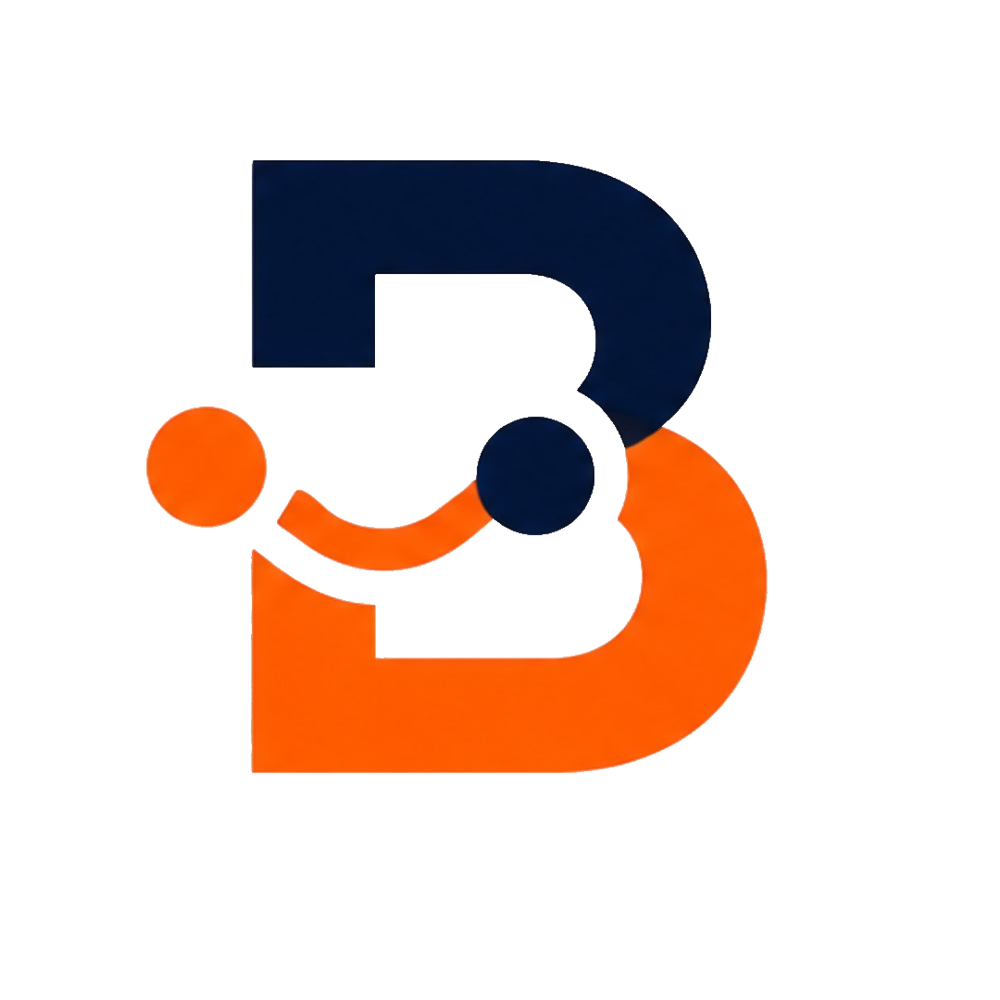

  <!-- Logo -->
  

  <!-- Onda corrigida -->
  

# **`Borafreela`**

> **Conectando talentos a oportunidades.**

O **BoraFreela** é uma plataforma desenvolvida como projeto acadêmico para conectar **profissionais que oferecem serviços** a **pessoas e empresas que precisam contratá-los**.

### Funcionalidades

*  Cadastro e autenticação
*  Perfil profissional
*  Divulgação de serviços
*  Busca por profissionais e serviços
*  Conexão entre clientes e profissionais

### Tecnologias

**HTML • CSS • JavaScript**

> **Projeto em desenvolvimento**

Desenvolvedores: Enzo Ximenes e Silva, Caudinei Conceição Fidelis Fernandes e Gabriela Siqueira de Souza
